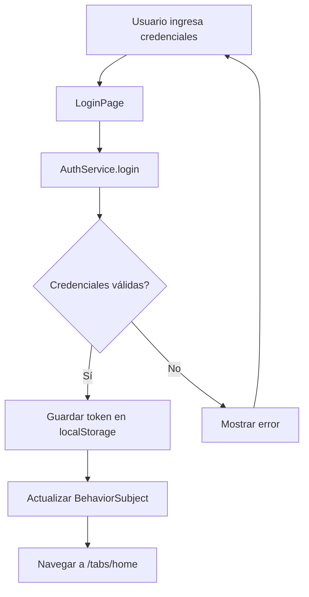
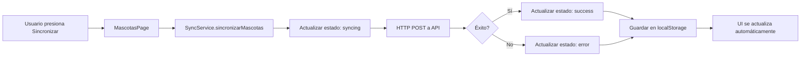
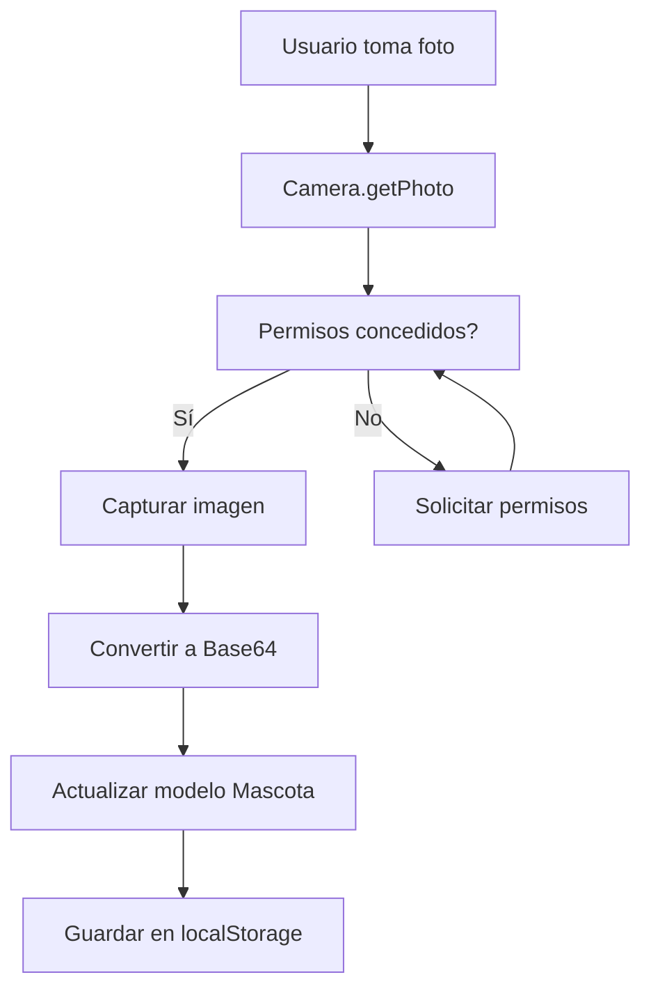

# 🏗️ Arquitectura del Proyecto Kuichi

## 📋 Tabla de Contenidos

1. [Visión General](#visión-general)
2. [Stack Tecnológico](#stack-tecnológico)
3. [Estructura del Proyecto](#estructura-del-proyecto)
4. [Arquitectura de Capas](#arquitectura-de-capas)
5. [Patrones de Diseño](#patrones-de-diseño)
6. [Flujo de Datos](#flujo-de-datos)
7. [Servicios](#servicios)
8. [Componentes](#componentes)
9. [Routing y Navegación](#routing-y-navegación)
10. [Gestión de Estado](#gestión-de-estado)
11. [Integración con APIs](#integración-con-apis)
12. [Almacenamiento](#almacenamiento)
13. [Seguridad](#seguridad)

---

## 🎯 Visión General

**Kuichi** es una aplicación móvil híbrida desarrollada con **Ionic Framework** y **Angular**, diseñada para la gestión integral de mascotas. La arquitectura sigue principios de **separación de responsabilidades**, **componentes standalone** y **programación reactiva**.

### Características Arquitectónicas Clave

- ✅ **Arquitectura Modular** - Componentes independientes y reutilizables
- ✅ **Standalone Components** - Sin módulos NgModule (Angular 20)
- ✅ **Reactive Programming** - RxJS para gestión de estado
- ✅ **Dependency Injection** - Inyección de dependencias nativa de Angular
- ✅ **Capacitor Integration** - Acceso a APIs nativas del dispositivo
- ✅ **RESTful API Communication** - Integración con servicios externos

---

## 🛠️ Stack Tecnológico

### Frontend Framework
```
Ionic Framework 8.7.9
├── Angular 20.0.0
│   ├── TypeScript 5.8.0
│   ├── RxJS 7.8.0
│   └── Zone.js 0.15.0
└── Ionic Components
    └── Ionicons 8.0.13
```

### Capacitor Plugins
```
Capacitor 7.4.4
├── @capacitor/camera 7.0.2
├── @capacitor/geolocation 7.1.5
├── @capacitor/preferences 7.0.2
├── @capacitor/app 7.1.0
├── @capacitor/haptics 7.0.2
└── @capacitor/keyboard 7.0.3
```

### Build Tools
```
Angular CLI 20.0.0
├── Webpack (integrado)
├── TypeScript Compiler
└── SCSS Preprocessor
```

---

## 📁 Estructura del Proyecto

```
kuichi/
├── src/
│   ├── app/
│   │   ├── guards/              # Route guards
│   │   │   └── auth.guard.ts
│   │   ├── models/              # Interfaces y tipos
│   │   │   ├── mascota.model.ts
│   │   │   └── veterinaria.model.ts
│   │   ├── pages/               # Páginas de la aplicación
│   │   │   ├── login/
│   │   │   ├── mascotas/
│   │   │   ├── veterinarias/
│   │   │   └── ofertas/
│   │   ├── pipes/               # Pipes personalizados
│   │   │   └── sanitize.pipe.ts
│   │   ├── services/            # Servicios de negocio
│   │   │   ├── auth.service.ts
│   │   │   ├── sync.service.ts
│   │   │   ├── api.service.ts
│   │   │   └── veterinaria.service.ts
│   │   ├── tabs/                # Navegación por tabs
│   │   │   ├── tabs.page.ts
│   │   │   ├── tabs.page.html
│   │   │   └── tabs.page.scss
│   │   ├── home/                # Página de inicio
│   │   ├── app.component.ts     # Componente raíz
│   │   └── app.routes.ts        # Configuración de rutas
│   ├── assets/                  # Recursos estáticos
│   │   └── images/
│   ├── environments/            # Configuración de entornos
│   ├── theme/                   # Estilos globales
│   │   └── variables.scss
│   ├── index.html               # HTML principal
│   └── main.ts                  # Punto de entrada
├── android/                     # Proyecto Android nativo
├── ios/                         # Proyecto iOS nativo
├── capacitor.config.ts          # Configuración de Capacitor
├── angular.json                 # Configuración de Angular
├── tsconfig.json                # Configuración de TypeScript
└── package.json                 # Dependencias del proyecto
```

---

## 🏛️ Arquitectura de Capas

La aplicación sigue una arquitectura en capas claramente definida:

```
┌─────────────────────────────────────────┐
│         PRESENTATION LAYER              │
│  (Components, Pages, Templates)         │
│  - mascotas.page.ts/html/scss          │
│  - veterinarias.page.ts/html/scss      │
│  - ofertas.page.ts/html/scss           │
└─────────────────────────────────────────┘
                    ↓
┌─────────────────────────────────────────┐
│         BUSINESS LOGIC LAYER            │
│  (Services, Guards, Pipes)              │
│  - auth.service.ts                      │
│  - sync.service.ts                      │
│  - api.service.ts                       │
└─────────────────────────────────────────┘
                    ↓
┌─────────────────────────────────────────┐
│         DATA ACCESS LAYER               │
│  (HTTP Client, LocalStorage, Capacitor) │
│  - HttpClient (Angular)                 │
│  - localStorage (Web API)               │
│  - Capacitor Plugins                    │
└─────────────────────────────────────────┘
                    ↓
┌─────────────────────────────────────────┐
│         EXTERNAL SERVICES               │
│  (APIs, Native Device Features)         │
│  - JSONPlaceholder API                  │
│  - Camera API                           │
│  - Geolocation API                      │
└─────────────────────────────────────────┘
```

---

## 🎨 Patrones de Diseño

### 1. **Dependency Injection (DI)**

Angular proporciona un sistema de DI robusto usado en toda la aplicación:

```typescript
@Injectable({
  providedIn: 'root'  // Singleton en toda la app
})
export class SyncService {
  private http = inject(HttpClient);  // Inyección moderna
  // ...
}
```

### 2. **Observable Pattern (RxJS)**

Gestión reactiva de estado y eventos:

```typescript
export class SyncService {
  private _syncState = new BehaviorSubject<SyncState>({
    status: 'idle',
    lastSyncedAt: null,
    message: ''
  });
  
  public syncState$ = this._syncState.asObservable();
}
```

### 3. **Repository Pattern**

Servicios actúan como repositorios de datos:

```typescript
export class VeterinariaService {
  getVeterinarias(): Observable<Veterinaria[]> {
    // Abstracción de la fuente de datos
  }
}
```

### 4. **Guard Pattern**

Protección de rutas con guards:

```typescript
export const authGuard: CanActivateFn = (route, state) => {
  const authService = inject(AuthService);
  
  if (!authService.isAuthenticated()) {
    const router = inject(Router);
    router.navigate(['/']);
    return false;
  }
  
  return true;
};
```

### 5. **Standalone Components**

Componentes sin módulos NgModule (Angular 20):

```typescript
@Component({
  selector: 'app-mascotas',
  standalone: true,
  imports: [CommonModule, IonicModule, FormsModule],
  templateUrl: './mascotas.page.html',
  styleUrls: ['./mascotas.page.scss'],
})
export class MascotasPage { }
```

---

## 🔄 Flujo de Datos

### Flujo de Autenticación



### Flujo de Sincronización



### Flujo de Datos con Periféricos



---

## 🔧 Servicios

### AuthService

**Responsabilidad:** Gestión de autenticación y sesiones

```typescript
export class AuthService {
  private _isAuthenticated = new BehaviorSubject<boolean>(false);
  public isAuthenticated$ = this._isAuthenticated.asObservable();
  
  async login(email: string, password: string): Promise<boolean>
  async logout(): Promise<void>
  isAuthenticated(): boolean
}
```

**Características:**
- Validación de credenciales
- Persistencia de token en localStorage
- Estado reactivo con BehaviorSubject
- Expiración de sesión (24 horas)

---

### SyncService

**Responsabilidad:** Sincronización bidireccional con servidor

```typescript
export class SyncService {
  private _syncState = new BehaviorSubject<SyncState>({...});
  public syncState$ = this._syncState.asObservable();
  
  async sincronizarMascotas(mascotas: Mascota[]): Promise<boolean>
  async importarDesdeAPI(): Promise<Mascota[]>
  getCurrentState(): SyncState
}
```

**Características:**
- Sincronización con servidor remoto
- Importación desde JSONPlaceholder API
- Gestión de estados (idle, syncing, success, error)
- Persistencia de timestamps

---

### ApiService

**Responsabilidad:** Comunicación HTTP con APIs externas

```typescript
export class ApiService {
  get<T>(endpoint: string): Observable<T>
  post<T>(endpoint: string, data: any): Observable<T>
}
```

**Características:**
- Métodos HTTP genéricos
- Manejo centralizado de errores
- Headers automáticos
- Base URL configurable

---

### VeterinariaService

**Responsabilidad:** Gestión de datos de veterinarias

```typescript
export class VeterinariaService {
  getVeterinarias(): Observable<Veterinaria[]>
  addVeterinaria(vet: Omit<Veterinaria, 'id'>): void
  updateVeterinaria(id: string, vet: Partial<Veterinaria>): void
  deleteVeterinaria(id: string): void
}
```

---

## 🧩 Componentes

### Estructura de un Componente

Cada componente sigue la estructura:

```
component-name/
├── component-name.page.ts       # Lógica del componente
├── component-name.page.html     # Template
├── component-name.page.scss     # Estilos
└── component-name.page.spec.ts  # Tests unitarios
```

### MascotasPage

**Responsabilidades:**
- CRUD de mascotas
- Integración con cámara
- Integración con GPS
- Sincronización con servidor
- Importación desde API

**Dependencias:**
- `AuthService` - Autenticación
- `SyncService` - Sincronización
- `ToastController` - Notificaciones
- `Router` - Navegación

---

## 🗺️ Routing y Navegación

### Configuración de Rutas

```typescript
export const routes: Routes = [
  {
    path: '',
    component: HomePage,
  },
  {
    path: 'login',
    loadComponent: () => import('./pages/login/login.page').then(m => m.LoginPage)
  },
  {
    path: 'tabs',
    component: TabsPage,
    canActivate: [authGuard],  // Protegido
    children: [
      {
        path: 'mascotas',
        loadComponent: () => import('./pages/mascotas/mascotas.page')
      },
      // ...
    ]
  }
];
```

### Estrategia de Carga

- **Lazy Loading:** Componentes cargados bajo demanda
- **Standalone Components:** Sin módulos NgModule
- **Route Guards:** Protección de rutas autenticadas

---

## 📊 Gestión de Estado

### Estado Local (Componente)

```typescript
export class MascotasPage {
  mascotas: Mascota[] = [];
  showForm = false;
  editingId: string | null = null;
}
```

### Estado Reactivo (Servicio)

```typescript
export class SyncService {
  private _syncState = new BehaviorSubject<SyncState>({
    status: 'idle',
    lastSyncedAt: null,
    message: ''
  });
  
  public syncState$ = this._syncState.asObservable();
}
```

### Persistencia

```typescript
// localStorage para datos locales
localStorage.setItem('kuichi_mascotas_v1', JSON.stringify(mascotas));

// Capacitor Preferences para configuración
await Preferences.set({ key: 'config', value: JSON.stringify(config) });
```

---

## 🌐 Integración con APIs

### API Externa: JSONPlaceholder

**Base URL:** `https://jsonplaceholder.typicode.com`

**Endpoints utilizados:**
- `GET /todos?_limit=5` - Importar tareas como mascotas

### Flujo de Integración

```typescript
// 1. Petición HTTP
const todos = await this.http.get<Todo[]>('/todos?_limit=5').toPromise();

// 2. Transformación de datos
const mascotas = todos.map(todo => ({
  id: `api-${todo.id}`,
  nombre: generarNombre(),
  especie: generarEspecie(),
  notas: `Importado: ${todo.title}`,
  syncStatus: 'synced'
}));

// 3. Persistencia local
localStorage.setItem('mascotas', JSON.stringify(mascotas));
```

---

## 💾 Almacenamiento

### Estrategia de Almacenamiento

```
┌─────────────────────────────────────┐
│      ALMACENAMIENTO LOCAL           │
├─────────────────────────────────────┤
│ localStorage                        │
│ - Mascotas (kuichi_mascotas_v1)    │
│ - Ofertas (kuichi_ofertas_v1)      │
│ - Auth token (auth_token)          │
│ - Última sync (kuichi_last_sync)   │
├─────────────────────────────────────┤
│ Capacitor Preferences               │
│ - Configuración de usuario         │
│ - Preferencias de la app           │
└─────────────────────────────────────┘
```

### Modelo de Datos

```typescript
// Mascota con campos de sincronización
export type Mascota = {
  id: string;
  nombre: string;
  especie: string;
  edad?: string;
  notas?: string;
  createdAt: number;
  foto?: string;
  syncStatus?: 'pending' | 'synced' | 'error';
  lastSyncedAt?: number;
  remoteId?: string;
};
```

---

## 🔐 Seguridad

### Autenticación

```typescript
// Token almacenado en localStorage
localStorage.setItem('auth_token', 'jwt_token');

// Verificación en cada petición
if (!authService.isAuthenticated()) {
  router.navigate(['/login']);
}
```

### Route Guards

```typescript
export const authGuard: CanActivateFn = (route, state) => {
  const authService = inject(AuthService);
  
  if (!authService.isAuthenticated()) {
    const router = inject(Router);
    router.navigate(['/'], {
      queryParams: { redirect: state.url }
    });
    return false;
  }
  
  return true;
};
```

### Permisos de Dispositivo

```typescript
// Solicitud de permisos de cámara
const image = await Camera.getPhoto({
  quality: 90,
  allowEditing: false,
  resultType: CameraResultType.DataUrl,
  source: CameraSource.Camera
});

// Solicitud de permisos de ubicación
const position = await Geolocation.getCurrentPosition({
  enableHighAccuracy: true,
  timeout: 10000
});
```

---

## 🚀 Despliegue

### Plataformas Soportadas

```
Kuichi
├── Web (PWA)
│   └── Build: npm run build
├── Android
│   ├── Sync: ionic cap sync android
│   └── Run: ionic cap run android
└── iOS
    ├── Sync: ionic cap sync ios
    └── Run: ionic cap run ios
```

### Proceso de Build

```bash
# 1. Build de la aplicación web
npm run build

# 2. Sincronizar con Capacitor
ionic cap sync

# 3. Abrir en IDE nativo
ionic cap open android  # o ios
```

---

## 📈 Escalabilidad

### Preparación para Crecimiento

**Backend Real:**
```typescript
// Fácil migración a backend real
const API_URL = environment.production 
  ? 'https://api.kuichi.com'
  : 'http://localhost:3000';
```

**State Management:**
```typescript
// Preparado para NgRx o Akita si es necesario
// Actualmente usa BehaviorSubject (suficiente para escala actual)
```

**Modularización:**
```typescript
// Estructura permite fácil división en feature modules
// Actualmente standalone components (más moderno)
```

---

## 🧪 Testing

### Estructura de Tests

```
src/app/
├── services/
│   ├── auth.service.spec.ts
│   ├── sync.service.spec.ts
│   └── api.service.spec.ts
└── pages/
    └── mascotas/
        └── mascotas.page.spec.ts
```

### Comandos de Testing

```bash
# Tests unitarios
npm test

# Tests con coverage
npm run test:coverage

# Tests E2E
npm run e2e
```

---

## 📚 Documentación Adicional

- [README.md](README.md) - Guía de usuario
- [PROJECT_EXPLANATION.md](PROJECT_EXPLANATION.md) - Explicación técnica
- [api_integration_documentation.md](docs/api_integration_documentation.md) - APIs
- [analisis_cumplimiento_requisitos.md](docs/analisis_cumplimiento_requisitos.md) - Cumplimiento

---

## 🎯 Principios de Diseño

1. **Separation of Concerns** - Cada capa tiene responsabilidades claras
2. **DRY (Don't Repeat Yourself)** - Servicios reutilizables
3. **SOLID Principles** - Especialmente Single Responsibility
4. **Reactive Programming** - RxJS para flujos de datos
5. **Mobile-First** - Diseñado para dispositivos móviles
6. **Progressive Enhancement** - Funciona offline, mejor online

---

**Versión:** 1.0.0  
**Última actualización:** 2025-11-23  
**Mantenido por:** Equipo Kuichi
